

 
  
<b>Final project 3 - Kelompok 1</b>

  
Aplikasi yang dibuat pada Final project ini adalah sebuah aplikasi mobile dengan menggunakan framework React Native. Aplikasi ini menggunakan API dari Rapaidapi dengan menerapkan sistem database  Local Storage.

 

---

## Panduan Aplikasi dari Sisi Pengguna (User Guide) 📒

Perlu diketahui sebelumnya bahwa di aplikasi Hotelio ini pengguna harus ;

1. Login terlebih dahulu menggunakan email dan password
2. Singup memasukan full name, email address, password, dan repeat password

---

### 1. Splashscreen

Halaman Splashcreen akan muncul pertama kali kita buka Aplikasi Hotelio

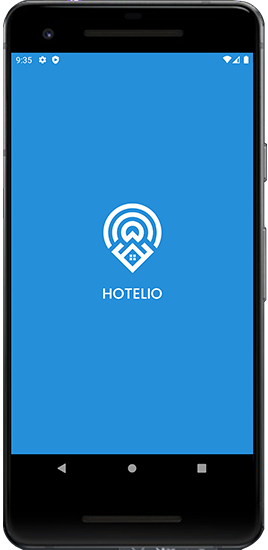

### 2. Intro Aplikasi

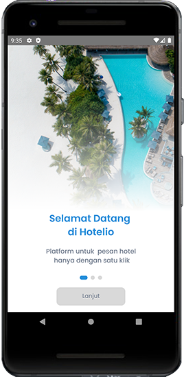
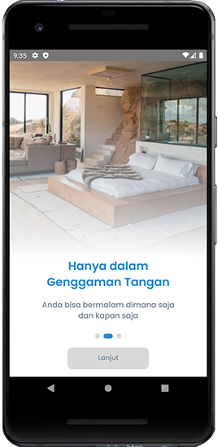
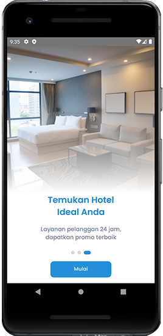

### 3. Sign In

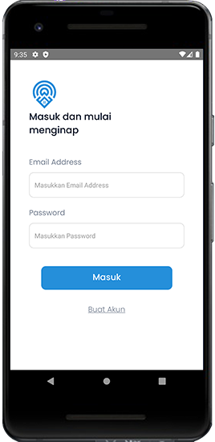

### 4. Sign Up

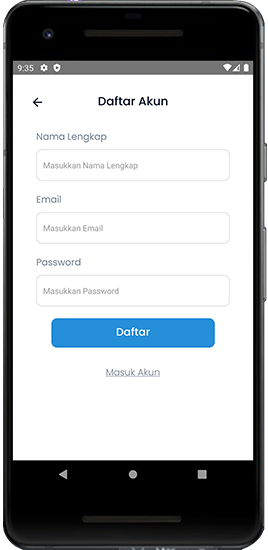

### 5. Halaman Utama (Beranda) 🏠

Halaman beranda adalah halaman yang pertama kali muncul ketika pengguna sudah melakukan signup dan login. Halaman ini berisi halaman cari berdasarkan (lokasi, kalender, dan room), kota populer, wisata trending, dam rekomendasi hotel. Halaman ini berisi detail hotel, dan juga terdapat tombol untuk Pesan. Pengguna dapat melihat detail hotel, dan memesan hotel dengan ketentuan harus login sebagai user terlebih dahulu.

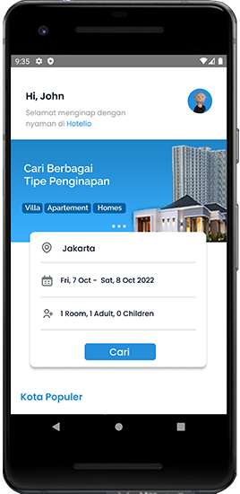
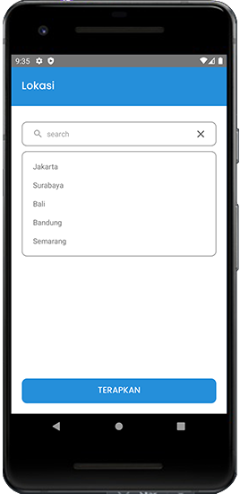
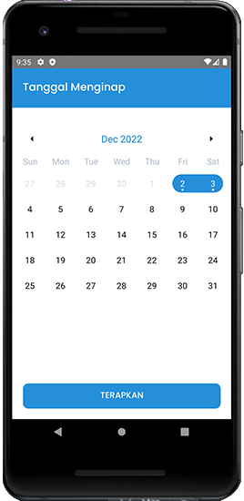
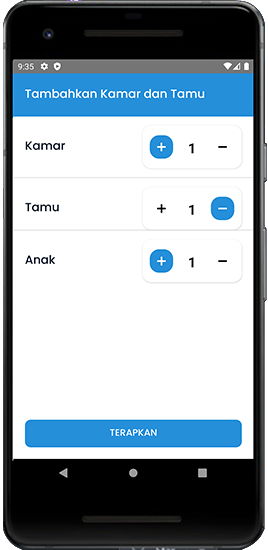

### 6. Halaman Detail Hotel

Halaman ini bersisi informasi terkait hotel dari harga, location, rating, deskripsi hoteal, fasilitas hotel. Ketika user tertarik dan cocok ingin menginap di hotel langsung bisa menekan tombol pesan yang ada di bawah halaman Detail Hotel

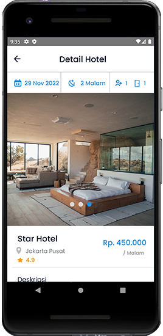

### 7. Halaman Favorit

Secara default halaman ini dibuat untuk menandai atau menambahkan hotel kedalam halaman favorit agar mempermudah user mengunjungi atau mengakses halaman ini kembali.

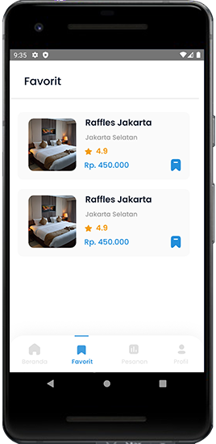

### 8. Halaman Pemesanan 📜

Halaman pemesanan ini berisi daftar produk yang telah dipesan. dihalaman ini user dapat membatalkan pesanan, lihat tiket dan detail pesanan.

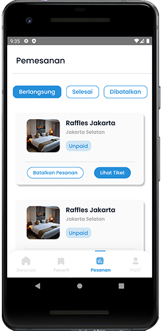
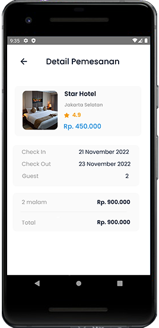

### 9. Halaman Profile

Halaman profil ini berisi informasi mengenai edit akun atau profil, developer, kontak bantuan dan tentang aplikasi.

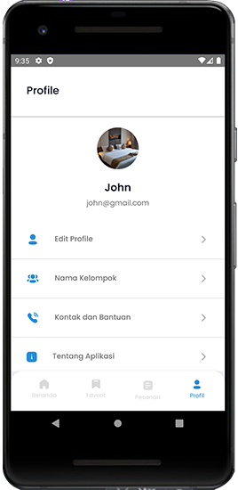
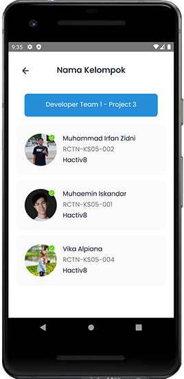
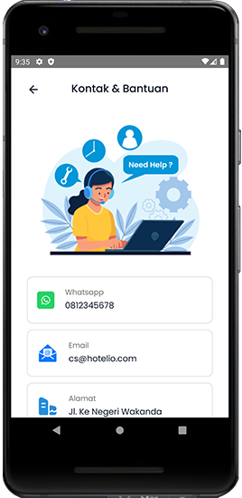

- Note: _Kedepannya akan dilakukan pengembangan lebih lanjut terkait project web app ini. Terima kasih._

[Silahkan lihat panduan terkhusus bagi Reviewer dan Developer di link ini](./docs)
